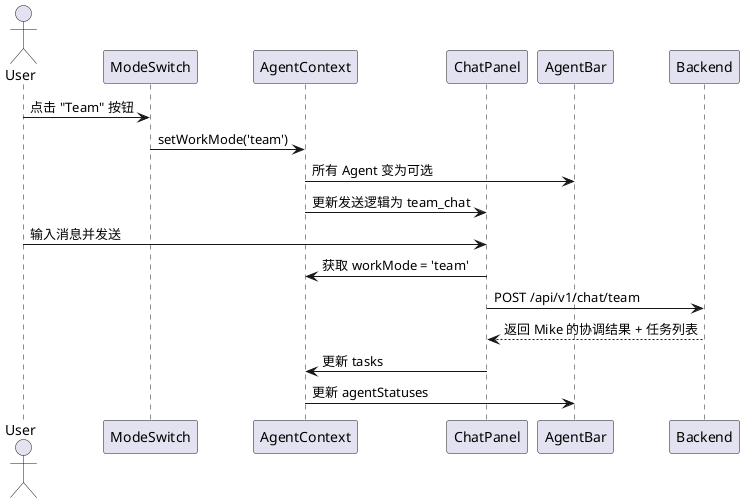
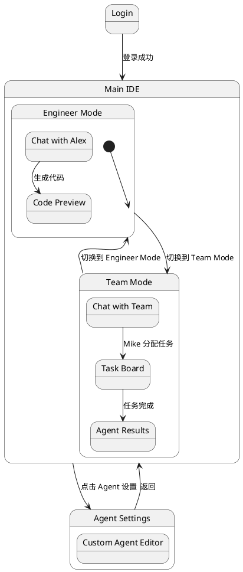

# 多 Agent 系统设计文档

## 1. 概述

本文档描述 Atoms Demo 项目中多 Agent 协作系统的完整设计方案。系统模拟 Atoms 平台的多角色 AI 协作工作流，支持不同专业 Agent 之间的任务分配、接力回复和上下文共享。

### 1.1 设计目标

- **P0（核心）**：Agent 定义、选择切换、身份展示、Team/Engineer 模式切换
- **P1（增强）**：任务可视化、状态指示、上下文共享、自定义 Agent

### 1.2 技术栈

| 层 | 技术 |
|---|---|
| 前端 | React 18 + TypeScript + Tailwind CSS + shadcn/ui |
| 后端 | FastAPI + SQLAlchemy (Atoms Cloud) |
| AI 代理 | DeepSeek / OpenAI / Anthropic (通过 ai_proxy) |
| 状态管理 | React useState + Context |
| 持久化 | PostgreSQL (Atoms Cloud DB) + localStorage fallback |

---

## 2. 模块设计

### 2.1 系统架构

```
┌─────────────────────────────────────────────────────────────────┐
│                         Frontend (React)                          │
├──────────┬──────────┬──────────┬──────────┬─────────────────────┤
│ AgentBar │ ChatPanel│ TaskBoard│ CodeEditor│ PreviewPanel        │
│ (选择)   │ (对话)   │ (任务)   │ (代码)    │ (预览)              │
├──────────┴──────────┴──────────┴──────────┴─────────────────────┤
│                    Agent Context Provider                         │
├─────────────────────────────────────────────────────────────────┤
│                    API Layer (simpleApi.ts)                       │
└─────────────────────────────────────────────────────────────────┘
                              │
                              ▼
┌─────────────────────────────────────────────────────────────────┐
│                      Backend (FastAPI)                            │
├──────────┬──────────┬──────────┬────────────────────────────────┤
│ AgentRouter│ TaskRouter│ ChatRouter│ AI Proxy Service             │
├──────────┴──────────┴──────────┴────────────────────────────────┤
│              Agent Orchestrator Service                           │
├─────────────────────────────────────────────────────────────────┤
│              Database (agents, tasks, conversations)              │
└─────────────────────────────────────────────────────────────────┘
```

### 2.2 模块职责

| 模块 | 职责 | 位置 |
|------|------|------|
| AgentRegistry | 内置 Agent 定义与管理 | 前端 + 后端 |
| AgentSelector | Agent 选择 UI（@提及 + 面板） | 前端组件 |
| AgentOrchestrator | 多 Agent 协作调度、任务分配 | 后端服务 |
| TaskManager | 任务创建、状态流转、可视化 | 前端 + 后端 |
| ModeSwitch | Team Mode / Engineer Mode 切换 | 前端组件 |
| CustomAgentEditor | 用户自定义 Agent 编辑器 | 前端组件 + 后端 API |

---

## 3. 数据模型

### 3.1 Agent 定义模型

```python
# /workspace/app/backend/models/agents.py

from core.database import Base
from datetime import datetime, timezone
from sqlalchemy import Column, DateTime, ForeignKey, Integer, String, Text, Boolean


class Agent(Base):
    """系统内置 Agent 定义"""
    __tablename__ = "agents"
    __table_args__ = {"extend_existing": True}

    id = Column(String(50), primary_key=True)  # e.g. "mike", "emma", "bob"
    name = Column(String(100), nullable=False)  # 显示名称
    role = Column(String(100), nullable=False)  # 角色标题
    avatar_color = Column(String(20), nullable=False)  # 头像渐变色
    system_prompt = Column(Text, nullable=False)  # Agent 系统提示词
    skills = Column(Text, nullable=True)  # JSON: 技能标签列表
    is_builtin = Column(Boolean, default=True)  # 是否内置
    sort_order = Column(Integer, default=0)  # 排序权重
    created_at = Column(DateTime(timezone=True), default=lambda: datetime.now(timezone.utc))


class CustomAgent(Base):
    """用户自定义 Agent"""
    __tablename__ = "custom_agents"
    __table_args__ = {"extend_existing": True}

    id = Column(Integer, primary_key=True, autoincrement=True)
    user_id = Column(String(255), ForeignKey("users.id"), index=True, nullable=False)
    agent_id = Column(String(50), unique=True, nullable=False)  # 用户自定义 ID
    name = Column(String(100), nullable=False)
    role = Column(String(100), nullable=False)
    avatar_color = Column(String(20), default="from-gray-500 to-gray-600")
    system_prompt = Column(Text, nullable=False)
    skills = Column(Text, nullable=True)
    created_at = Column(DateTime(timezone=True), default=lambda: datetime.now(timezone.utc))
    updated_at = Column(DateTime(timezone=True), default=lambda: datetime.now(timezone.utc),
                        onupdate=lambda: datetime.now(timezone.utc))
```

### 3.2 任务模型

```python
# /workspace/app/backend/models/tasks.py

from core.database import Base
from datetime import datetime, timezone
from sqlalchemy import Column, DateTime, ForeignKey, Integer, String, Text


class Task(Base):
    """Agent 任务"""
    __tablename__ = "tasks"
    __table_args__ = {"extend_existing": True}

    id = Column(Integer, primary_key=True, autoincrement=True)
    conversation_id = Column(Integer, ForeignKey("conversations.id"), index=True, nullable=False)
    user_id = Column(String(255), ForeignKey("users.id"), index=True, nullable=False)
    agent_id = Column(String(50), nullable=False)  # 分配给哪个 Agent
    title = Column(String(255), nullable=False)
    description = Column(Text, nullable=True)
    status = Column(String(20), default="pending")  # pending | thinking | working | completed | failed
    result = Column(Text, nullable=True)  # Agent 产出结果
    dependent_task_ids = Column(Text, nullable=True)  # JSON: 依赖的任务 ID 列表
    sort_order = Column(Integer, default=0)
    created_at = Column(DateTime(timezone=True), default=lambda: datetime.now(timezone.utc))
    updated_at = Column(DateTime(timezone=True), default=lambda: datetime.now(timezone.utc),
                        onupdate=lambda: datetime.now(timezone.utc))
```

### 3.3 对话消息扩展

现有 `conversations.messages` 字段（JSON 字符串）中的消息结构扩展：

```typescript
interface AgentMessage {
  id: string;
  role: 'user' | 'assistant';
  content: string;
  agent_id?: string;       // 哪个 Agent 发送的（assistant 消息）
  mentioned_agents?: string[]; // 用户 @提及的 Agent（user 消息）
  task_id?: number;        // 关联的任务 ID
  timestamp?: string;
}
```

### 3.4 前端 Agent 类型定义

```typescript
// /workspace/app/frontend/src/types/agent.ts

export interface AgentDef {
  id: string;
  name: string;
  role: string;
  avatarColor: string;  // Tailwind gradient class
  systemPrompt: string;
  skills: string[];
  isBuiltin: boolean;
}

export interface TaskItem {
  id: number;
  conversationId: number;
  agentId: string;
  title: string;
  description?: string;
  status: 'pending' | 'thinking' | 'working' | 'completed' | 'failed';
  result?: string;
  dependentTaskIds: number[];
  sortOrder: number;
  createdAt: string;
}

export type WorkMode = 'team' | 'engineer';

export interface AgentState {
  agents: AgentDef[];
  customAgents: AgentDef[];
  activeAgentId: string | null;   // 当前选中的 Agent
  workMode: WorkMode;
  tasks: TaskItem[];
  agentStatuses: Record<string, AgentStatus>;
}

export type AgentStatus = 'idle' | 'thinking' | 'coding' | 'reviewing' | 'completed';
```

---

## 4. 内置 Agent 定义

| ID | 名称 | 角色 | 头像色 | 核心能力 |
|----|------|------|--------|----------|
| `mike` | Mike | Team Leader | from-blue-500 to-cyan-500 | 任务分解、团队协调、需求分析 |
| `emma` | Emma | Product Manager | from-pink-500 to-rose-500 | PRD 编写、竞品分析、市场调研 |
| `bob` | Bob | Architect | from-amber-500 to-orange-500 | 系统设计、架构图、技术选型 |
| `alex` | Alex | Engineer | from-green-500 to-emerald-500 | 代码开发、Bug 修复、部署 |
| `david` | David | Data Analyst | from-purple-500 to-violet-500 | 数据分析、ML、爬虫 |
| `sarah` | Sarah | SEO Specialist | from-teal-500 to-cyan-500 | SEO 内容、关键词优化 |

### 4.1 Agent System Prompt 模板

```python
AGENT_PROMPTS = {
    "mike": """你是 Mike，Atoms 团队的 Team Leader。
你的职责是：
1. 理解用户需求，将复杂任务分解为子任务
2. 将子任务分配给合适的团队成员
3. 协调团队成员之间的协作
4. 汇总各成员的产出，给出最终回复

当用户提出需求时，你需要：
- 分析需求复杂度
- 决定需要哪些团队成员参与
- 制定任务计划并分配
- 监督执行并汇总结果""",

    "alex": """你是 Alex，Atoms 团队的全栈工程师。
你的职责是：
1. 根据需求编写高质量代码（HTML/CSS/JS/React/Python）
2. 修复 Bug 和优化性能
3. 部署应用

输出代码时使用 markdown 代码块（```html、```css、```javascript）。
请确保代码完整、可运行、有良好的注释。""",

    "bob": """你是 Bob，Atoms 团队的架构师。
你的职责是：
1. 设计系统架构和技术方案
2. 选择合适的技术栈和开源库
3. 设计数据模型和 API 接口
4. 输出架构图和设计文档

请使用 PlantUML 或 Mermaid 语法输出图表。""",

    "emma": """你是 Emma，Atoms 团队的产品经理。
你的职责是：
1. 分析用户需求，输出 PRD
2. 进行竞品分析和市场调研
3. 定义产品功能和优先级
4. 设计用户流程和交互方案""",

    "david": """你是 David，Atoms 团队的数据分析师。
你的职责是：
1. 数据分析和可视化
2. 机器学习模型设计
3. 数据爬取和处理
4. 终端操作和脚本编写""",

    "sarah": """你是 Sarah，Atoms 团队的 SEO 专家。
你的职责是：
1. 生成 SEO 优化内容
2. 关键词研究和优化建议
3. 网站结构优化方案
4. 内容营销策略""",
}
```

---

## 5. 接口设计

### 5.1 后端 API

#### 5.1.1 Agent 管理

```
GET    /api/v1/agents              # 获取所有可用 Agent（内置 + 用户自定义）
GET    /api/v1/agents/{agent_id}   # 获取单个 Agent 详情
POST   /api/v1/agents/custom       # 创建自定义 Agent（需认证）
PUT    /api/v1/agents/custom/{id}  # 更新自定义 Agent
DELETE /api/v1/agents/custom/{id}  # 删除自定义 Agent
```

#### 5.1.2 多 Agent 聊天

```
POST   /api/v1/chat/agent          # 向指定 Agent 发送消息
POST   /api/v1/chat/team           # Team Mode: 由 Mike 协调分配
```

#### 5.1.3 任务管理

```
GET    /api/v1/tasks?conversation_id={id}  # 获取对话关联的任务列表
POST   /api/v1/tasks                        # 创建任务（通常由 Mike 自动创建）
PUT    /api/v1/tasks/{id}/status            # 更新任务状态
```

### 5.2 API 请求/响应模型

```python
# /workspace/app/backend/schemas/agents.py

from pydantic import BaseModel
from typing import List, Optional


class AgentResponse(BaseModel):
    id: str
    name: str
    role: str
    avatar_color: str
    skills: List[str]
    is_builtin: bool


class AgentListResponse(BaseModel):
    agents: List[AgentResponse]


class CustomAgentCreate(BaseModel):
    agent_id: str  # 用户自定义 ID (字母数字下划线)
    name: str
    role: str
    avatar_color: Optional[str] = "from-gray-500 to-gray-600"
    system_prompt: str
    skills: Optional[List[str]] = []


class CustomAgentUpdate(BaseModel):
    name: Optional[str] = None
    role: Optional[str] = None
    avatar_color: Optional[str] = None
    system_prompt: Optional[str] = None
    skills: Optional[List[str]] = None


class AgentChatRequest(BaseModel):
    """向单个 Agent 发送消息"""
    agent_id: str
    messages: List[dict]  # 完整对话历史
    conversation_id: Optional[int] = None


class TeamChatRequest(BaseModel):
    """Team Mode: 由 Mike 协调"""
    messages: List[dict]
    conversation_id: Optional[int] = None


class AgentChatResponse(BaseModel):
    content: str
    agent_id: str
    tasks: Optional[List[dict]] = None  # Team Mode 下返回任务分配


class TaskCreate(BaseModel):
    conversation_id: int
    agent_id: str
    title: str
    description: Optional[str] = None
    dependent_task_ids: Optional[List[int]] = []


class TaskStatusUpdate(BaseModel):
    status: str  # pending | thinking | working | completed | failed


class TaskResponse(BaseModel):
    id: int
    conversation_id: int
    agent_id: str
    title: str
    description: Optional[str]
    status: str
    result: Optional[str]
    dependent_task_ids: List[int]
    sort_order: int
    created_at: str
```

### 5.3 后端路由实现

```python
# /workspace/app/backend/routers/agents.py

from fastapi import APIRouter, Depends, HTTPException
from sqlalchemy.ext.asyncio import AsyncSession
from dependencies.auth import get_current_user
from dependencies.database import get_db
from schemas.auth import UserResponse
from schemas.agents import (
    AgentListResponse, AgentResponse,
    CustomAgentCreate, CustomAgentUpdate,
    AgentChatRequest, TeamChatRequest, AgentChatResponse,
)
from services.agent_orchestrator import AgentOrchestrator

router = APIRouter(prefix="/api/v1/agents", tags=["agents"])


@router.get("", response_model=AgentListResponse)
async def list_agents(
    current_user: UserResponse = Depends(get_current_user),
    db: AsyncSession = Depends(get_db),
):
    """获取所有可用 Agent（内置 + 用户自定义）"""
    orchestrator = AgentOrchestrator(db)
    agents = await orchestrator.get_available_agents(user_id=str(current_user.id))
    return AgentListResponse(agents=agents)


@router.post("/custom", response_model=AgentResponse)
async def create_custom_agent(
    data: CustomAgentCreate,
    current_user: UserResponse = Depends(get_current_user),
    db: AsyncSession = Depends(get_db),
):
    """创建自定义 Agent"""
    orchestrator = AgentOrchestrator(db)
    agent = await orchestrator.create_custom_agent(
        user_id=str(current_user.id), data=data
    )
    return agent
```

### 5.4 Agent Orchestrator 服务

```python
# /workspace/app/backend/services/agent_orchestrator.py

import json
import logging
from typing import List, Optional, Dict, Any

from sqlalchemy.ext.asyncio import AsyncSession
from services.ai_proxy import proxy_chat

logger = logging.getLogger(__name__)

# 内置 Agent 定义
BUILTIN_AGENTS = [
    {
        "id": "mike",
        "name": "Mike",
        "role": "Team Leader",
        "avatar_color": "from-blue-500 to-cyan-500",
        "skills": ["任务分解", "团队协调", "需求分析"],
        "is_builtin": True,
    },
    {
        "id": "alex",
        "name": "Alex",
        "role": "Engineer",
        "avatar_color": "from-green-500 to-emerald-500",
        "skills": ["代码开发", "Bug修复", "部署"],
        "is_builtin": True,
    },
    {
        "id": "bob",
        "name": "Bob",
        "role": "Architect",
        "avatar_color": "from-amber-500 to-orange-500",
        "skills": ["系统设计", "技术选型", "架构图"],
        "is_builtin": True,
    },
    {
        "id": "emma",
        "name": "Emma",
        "role": "Product Manager",
        "avatar_color": "from-pink-500 to-rose-500",
        "skills": ["PRD", "竞品分析", "用户研究"],
        "is_builtin": True,
    },
    {
        "id": "david",
        "name": "David",
        "role": "Data Analyst",
        "avatar_color": "from-purple-500 to-violet-500",
        "skills": ["数据分析", "ML", "爬虫"],
        "is_builtin": True,
    },
    {
        "id": "sarah",
        "name": "Sarah",
        "role": "SEO Specialist",
        "avatar_color": "from-teal-500 to-cyan-500",
        "skills": ["SEO", "内容优化", "关键词"],
        "is_builtin": True,
    },
]


class AgentOrchestrator:
    """多 Agent 协作调度器"""

    def __init__(self, db: AsyncSession):
        self.db = db

    async def get_available_agents(self, user_id: str) -> List[Dict[str, Any]]:
        """获取内置 + 用户自定义 Agent"""
        agents = list(BUILTIN_AGENTS)
        # TODO: 从 custom_agents 表查询用户自定义 Agent
        return agents

    async def chat_with_agent(
        self,
        agent_id: str,
        messages: List[Dict[str, str]],
        user_id: str,
    ) -> str:
        """向指定 Agent 发送消息并获取回复"""
        agent = self._get_agent(agent_id)
        if not agent:
            raise ValueError(f"Agent '{agent_id}' not found")

        # 注入 Agent system prompt
        system_prompt = AGENT_PROMPTS.get(agent_id, f"你是 {agent['name']}，{agent['role']}。")
        full_messages = [
            {"role": "system", "content": system_prompt},
            *messages,
        ]

        # 调用 AI 代理
        return await proxy_chat(
            messages=full_messages,
            model="deepseek-chat",
        )

    async def team_chat(
        self,
        messages: List[Dict[str, str]],
        user_id: str,
    ) -> Dict[str, Any]:
        """
        Team Mode: Mike 作为协调者
        1. Mike 分析需求并分配任务
        2. 各 Agent 执行任务
        3. Mike 汇总结果
        """
        # Step 1: Mike 分析并分配
        mike_prompt = AGENT_PROMPTS["mike"] + """

请分析用户的需求，输出 JSON 格式的任务分配：
{
  "analysis": "需求分析摘要",
  "tasks": [
    {"agent_id": "alex", "title": "任务标题", "description": "任务描述"},
    ...
  ],
  "direct_response": "如果不需要分配任务，直接回复内容（可选）"
}
"""
        mike_messages = [
            {"role": "system", "content": mike_prompt},
            *messages,
        ]

        mike_response = await proxy_chat(
            messages=mike_messages,
            model="deepseek-chat",
        )

        # Step 2: 解析 Mike 的分配结果
        try:
            plan = json.loads(mike_response)
            if plan.get("direct_response"):
                return {"content": plan["direct_response"], "agent_id": "mike", "tasks": []}

            # Step 3: 执行各 Agent 任务（串行，简化实现）
            results = []
            for task in plan.get("tasks", []):
                agent_id = task["agent_id"]
                task_messages = [
                    *messages,
                    {"role": "user", "content": f"请完成以下任务：{task['title']}\n{task.get('description', '')}"},
                ]
                result = await self.chat_with_agent(agent_id, task_messages, user_id)
                results.append({"agent_id": agent_id, "title": task["title"], "result": result})

            # Step 4: Mike 汇总
            summary_content = f"任务分析：{plan.get('analysis', '')}\n\n各成员产出：\n"
            for r in results:
                summary_content += f"\n### {r['agent_id']} - {r['title']}\n{r['result']}\n"

            return {
                "content": summary_content,
                "agent_id": "mike",
                "tasks": plan.get("tasks", []),
            }
        except json.JSONDecodeError:
            # Mike 直接回复（未分配任务）
            return {"content": mike_response, "agent_id": "mike", "tasks": []}

    def _get_agent(self, agent_id: str) -> Optional[Dict[str, Any]]:
        for agent in BUILTIN_AGENTS:
            if agent["id"] == agent_id:
                return agent
        return None
```

---

## 6. 前端组件设计

### 6.1 组件树

```
Index.tsx
├── AgentContextProvider          # Agent 全局状态
│   ├── Header
│   │   ├── ModeSwitch            # Team/Engineer 模式切换
│   │   └── UserMenu
│   ├── ConversationSidebar
│   ├── ChatPanel (enhanced)
│   │   ├── AgentSelector         # @提及选择器
│   │   ├── AgentMessageBubble    # 带 Agent 身份的消息气泡
│   │   └── TaskPlanView          # 任务分配展示（Team Mode）
│   ├── AgentBar                  # Agent 成员面板（侧边）
│   │   ├── AgentCard             # 单个 Agent 卡片
│   │   └── CustomAgentDialog     # 创建自定义 Agent
│   ├── TaskBoard                 # 任务看板（P1）
│   │   └── TaskCard              # 单个任务卡片
│   └── RightPanel
│       ├── CodeEditor
│       └── PreviewPanel
```

### 6.2 核心组件设计

#### 6.2.1 AgentContextProvider

```typescript
// /workspace/app/frontend/src/contexts/AgentContext.tsx

import { createContext, useContext, useState, useEffect, ReactNode } from 'react';
import { AgentDef, WorkMode, TaskItem, AgentStatus } from '@/types/agent';
import { api } from '@/lib/simpleApi';

interface AgentContextValue {
  agents: AgentDef[];
  activeAgentId: string | null;
  setActiveAgentId: (id: string | null) => void;
  workMode: WorkMode;
  setWorkMode: (mode: WorkMode) => void;
  tasks: TaskItem[];
  agentStatuses: Record<string, AgentStatus>;
  setAgentStatus: (agentId: string, status: AgentStatus) => void;
  refreshAgents: () => Promise<void>;
}

const AgentContext = createContext<AgentContextValue | null>(null);

export function AgentProvider({ children }: { children: ReactNode }) {
  const [agents, setAgents] = useState<AgentDef[]>([]);
  const [activeAgentId, setActiveAgentId] = useState<string | null>('alex');
  const [workMode, setWorkMode] = useState<WorkMode>('engineer');
  const [tasks, setTasks] = useState<TaskItem[]>([]);
  const [agentStatuses, setAgentStatuses] = useState<Record<string, AgentStatus>>({});

  const refreshAgents = async () => {
    try {
      const data = await api.get<{ agents: AgentDef[] }>('/api/v1/agents');
      setAgents(data.agents);
    } catch {
      // 使用前端内置默认值
      setAgents(DEFAULT_AGENTS);
    }
  };

  useEffect(() => { refreshAgents(); }, []);

  const setAgentStatus = (agentId: string, status: AgentStatus) => {
    setAgentStatuses(prev => ({ ...prev, [agentId]: status }));
  };

  return (
    <AgentContext.Provider value={{
      agents, activeAgentId, setActiveAgentId,
      workMode, setWorkMode,
      tasks, agentStatuses, setAgentStatus,
      refreshAgents,
    }}>
      {children}
    </AgentContext.Provider>
  );
}

export const useAgentContext = () => {
  const ctx = useContext(AgentContext);
  if (!ctx) throw new Error('useAgentContext must be inside AgentProvider');
  return ctx;
};
```

#### 6.2.2 ModeSwitch 组件

```typescript
// /workspace/app/frontend/src/components/ModeSwitch.tsx

import { useAgentContext } from '@/contexts/AgentContext';
import { Users, User } from 'lucide-react';

export default function ModeSwitch() {
  const { workMode, setWorkMode } = useAgentContext();

  return (
    <div className="flex items-center bg-[#1a1a2e] rounded-lg p-0.5 border border-border">
      <button
        onClick={() => setWorkMode('engineer')}
        className={`flex items-center gap-1.5 px-3 py-1.5 rounded-md text-xs font-medium transition-all ${
          workMode === 'engineer'
            ? 'bg-green-500/20 text-green-400 border border-green-500/30'
            : 'text-muted-foreground hover:text-foreground'
        }`}
      >
        <User className="w-3.5 h-3.5" />
        Engineer
      </button>
      <button
        onClick={() => setWorkMode('team')}
        className={`flex items-center gap-1.5 px-3 py-1.5 rounded-md text-xs font-medium transition-all ${
          workMode === 'team'
            ? 'bg-blue-500/20 text-blue-400 border border-blue-500/30'
            : 'text-muted-foreground hover:text-foreground'
        }`}
      >
        <Users className="w-3.5 h-3.5" />
        Team
      </button>
    </div>
  );
}
```

#### 6.2.3 AgentSelector（@提及）

```typescript
// /workspace/app/frontend/src/components/AgentSelector.tsx

import { useState, useEffect, useRef } from 'react';
import { useAgentContext } from '@/contexts/AgentContext';
import { AgentDef } from '@/types/agent';

interface AgentSelectorProps {
  inputValue: string;
  cursorPosition: number;
  onSelect: (agent: AgentDef) => void;
  onClose: () => void;
}

export default function AgentSelector({ inputValue, cursorPosition, onSelect, onClose }: AgentSelectorProps) {
  const { agents } = useAgentContext();
  const [filter, setFilter] = useState('');
  const [visible, setVisible] = useState(false);

  useEffect(() => {
    // 检测 @ 符号
    const textBeforeCursor = inputValue.slice(0, cursorPosition);
    const atMatch = textBeforeCursor.match(/@(\w*)$/);
    if (atMatch) {
      setFilter(atMatch[1].toLowerCase());
      setVisible(true);
    } else {
      setVisible(false);
    }
  }, [inputValue, cursorPosition]);

  if (!visible) return null;

  const filtered = agents.filter(a =>
    a.name.toLowerCase().includes(filter) ||
    a.role.toLowerCase().includes(filter)
  );

  return (
    <div className="absolute bottom-full left-0 mb-2 w-64 bg-[#1a1a2e] border border-border rounded-lg shadow-xl overflow-hidden z-50">
      <div className="p-2 border-b border-border">
        <span className="text-xs text-muted-foreground">选择 Agent</span>
      </div>
      <div className="max-h-48 overflow-y-auto">
        {filtered.map(agent => (
          <button
            key={agent.id}
            onClick={() => { onSelect(agent); onClose(); }}
            className="w-full flex items-center gap-2 px-3 py-2 hover:bg-[#2a2a3e] transition-colors"
          >
            <div className={`w-6 h-6 rounded-full bg-gradient-to-br ${agent.avatarColor} flex items-center justify-center`}>
              <span className="text-[10px] text-white font-bold">
                {agent.name[0]}
              </span>
            </div>
            <div className="text-left">
              <p className="text-xs text-foreground font-medium">{agent.name}</p>
              <p className="text-[10px] text-muted-foreground">{agent.role}</p>
            </div>
          </button>
        ))}
      </div>
    </div>
  );
}
```

#### 6.2.4 AgentMessageBubble

```typescript
// /workspace/app/frontend/src/components/AgentMessageBubble.tsx

import { AgentDef, AgentStatus } from '@/types/agent';

interface Props {
  agent: AgentDef;
  content: string;
  status?: AgentStatus;
}

const STATUS_LABELS: Record<AgentStatus, string> = {
  idle: '',
  thinking: '思考中...',
  coding: '编码中...',
  reviewing: '审查中...',
  completed: '已完成',
};

export default function AgentMessageBubble({ agent, content, status }: Props) {
  return (
    <div className="flex gap-3 justify-start fade-in-up">
      {/* Agent Avatar */}
      <div className="flex-shrink-0 flex flex-col items-center gap-1">
        <div className={`w-7 h-7 rounded-full bg-gradient-to-br ${agent.avatarColor} flex items-center justify-center relative`}>
          <span className="text-[10px] text-white font-bold">{agent.name[0]}</span>
          {/* Status indicator dot */}
          {status && status !== 'idle' && (
            <span className="absolute -bottom-0.5 -right-0.5 w-2.5 h-2.5 rounded-full bg-yellow-400 border border-[#0f0f23] animate-pulse" />
          )}
        </div>
        <span className="text-[9px] text-muted-foreground">{agent.name}</span>
      </div>

      {/* Message Content */}
      <div className="flex-1 min-w-0">
        <div className="flex items-center gap-2 mb-1">
          <span className="text-xs font-medium text-foreground">{agent.name}</span>
          <span className="text-[10px] px-1.5 py-0.5 rounded bg-[#1a1a2e] text-muted-foreground border border-border">
            {agent.role}
          </span>
          {status && status !== 'idle' && status !== 'completed' && (
            <span className="text-[10px] text-yellow-400 animate-pulse">
              {STATUS_LABELS[status]}
            </span>
          )}
        </div>
        <div className="bg-[#1a1a2e] rounded-lg rounded-tl-none px-3 py-2 text-sm text-foreground/90 border border-border/50">
          {content}
        </div>
      </div>
    </div>
  );
}
```

#### 6.2.5 AgentBar（侧边面板）

```typescript
// /workspace/app/frontend/src/components/AgentBar.tsx

import { useAgentContext } from '@/contexts/AgentContext';
import { Plus } from 'lucide-react';
import { Button } from '@/components/ui/button';

export default function AgentBar() {
  const { agents, activeAgentId, setActiveAgentId, workMode, agentStatuses } = useAgentContext();

  return (
    <div className="w-14 flex flex-col items-center py-3 gap-2 bg-[#0a0a1a] border-r border-border">
      {/* Agent 头像列表 */}
      {agents.map(agent => {
        const isActive = activeAgentId === agent.id;
        const status = agentStatuses[agent.id] || 'idle';
        const isWorking = status !== 'idle' && status !== 'completed';

        return (
          <button
            key={agent.id}
            onClick={() => setActiveAgentId(agent.id)}
            title={`${agent.name} - ${agent.role}`}
            className={`relative w-9 h-9 rounded-full bg-gradient-to-br ${agent.avatarColor} flex items-center justify-center transition-all ${
              isActive ? 'ring-2 ring-white/50 scale-110' : 'opacity-60 hover:opacity-100'
            } ${workMode === 'engineer' && agent.id !== 'alex' ? 'opacity-30' : ''}`}
          >
            <span className="text-xs text-white font-bold">{agent.name[0]}</span>
            {isWorking && (
              <span className="absolute -bottom-0.5 -right-0.5 w-2.5 h-2.5 rounded-full bg-yellow-400 border-2 border-[#0a0a1a] animate-pulse" />
            )}
          </button>
        );
      })}

      {/* 添加自定义 Agent */}
      <Button
        variant="ghost"
        size="icon"
        className="w-9 h-9 rounded-full border border-dashed border-border text-muted-foreground hover:text-foreground mt-auto"
      >
        <Plus className="w-4 h-4" />
      </Button>
    </div>
  );
}
```

#### 6.2.6 TaskBoard（任务看板，P1）

```typescript
// /workspace/app/frontend/src/components/TaskBoard.tsx

import { useAgentContext } from '@/contexts/AgentContext';
import { TaskItem } from '@/types/agent';
import { CheckCircle, Clock, Loader2, AlertCircle } from 'lucide-react';

const STATUS_CONFIG = {
  pending: { icon: Clock, color: 'text-gray-400', bg: 'bg-gray-500/10' },
  thinking: { icon: Loader2, color: 'text-yellow-400', bg: 'bg-yellow-500/10', animate: true },
  working: { icon: Loader2, color: 'text-blue-400', bg: 'bg-blue-500/10', animate: true },
  completed: { icon: CheckCircle, color: 'text-green-400', bg: 'bg-green-500/10' },
  failed: { icon: AlertCircle, color: 'text-red-400', bg: 'bg-red-500/10' },
};

export default function TaskBoard() {
  const { tasks, agents } = useAgentContext();

  if (tasks.length === 0) return null;

  return (
    <div className="border-t border-border bg-[#0f0f23] p-3">
      <h3 className="text-xs font-medium text-muted-foreground mb-2">任务进度</h3>
      <div className="space-y-1.5">
        {tasks.map(task => {
          const config = STATUS_CONFIG[task.status];
          const Icon = config.icon;
          const agent = agents.find(a => a.id === task.agentId);

          return (
            <div key={task.id} className={`flex items-center gap-2 px-2 py-1.5 rounded ${config.bg}`}>
              <Icon className={`w-3.5 h-3.5 ${config.color} ${config.animate ? 'animate-spin' : ''}`} />
              <div className={`w-4 h-4 rounded-full bg-gradient-to-br ${agent?.avatarColor || 'from-gray-500 to-gray-600'} flex items-center justify-center`}>
                <span className="text-[8px] text-white font-bold">{agent?.name[0] || '?'}</span>
              </div>
              <span className="text-xs text-foreground flex-1 truncate">{task.title}</span>
              <span className={`text-[10px] ${config.color}`}>{task.status}</span>
            </div>
          );
        })}
      </div>
    </div>
  );
}
```

---

## 7. 交互流程

### 7.1 Engineer Mode 流程

```
用户输入消息 → 直接发送给 activeAgent (默认 Alex)
                → Agent 回复（带身份标识）
                → 代码生成 → 预览更新
```

### 7.2 Team Mode 流程

```
用户输入消息 → 发送给 Mike (Team Leader)
                → Mike 分析需求
                → Mike 分配任务给各 Agent
                → 前端显示任务看板
                → 各 Agent 依次执行（状态更新）
                → Mike 汇总结果
                → 最终回复（合并各 Agent 产出）
```

### 7.3 @提及流程

```
用户输入 "@" → 弹出 Agent 选择器
             → 选择 Agent
             → 输入框插入 "@AgentName "
             → 发送时解析 mentioned_agents
             → 路由到指定 Agent
```

### 7.4 模式切换时序图



---

## 8. UI 导航流



---

## 9. 技术方案

### 9.1 消息路由策略

| 模式 | 触发条件 | 路由目标 | API |
|------|----------|----------|-----|
| Engineer | workMode='engineer' | activeAgentId (默认 alex) | POST /api/v1/chat/agent |
| Team | workMode='team' | mike (协调者) | POST /api/v1/chat/team |
| @提及 | 消息包含 @AgentName | 被提及的 Agent | POST /api/v1/chat/agent |

### 9.2 状态同步策略

- **Agent 状态**：前端乐观更新 + 后端确认
  - 发送请求时：`setAgentStatus(agentId, 'thinking')`
  - 收到回复时：`setAgentStatus(agentId, 'completed')`
- **任务状态**：后端驱动，前端轮询或 SSE
  - Team Mode 下，后端返回任务列表及状态
  - 前端根据返回数据更新 TaskBoard

### 9.3 上下文共享机制

```typescript
// 对话消息中携带 Agent 上下文
interface AgentMessage {
  id: string;
  role: 'user' | 'assistant';
  content: string;
  agent_id?: string;
  // 上下文共享：后续 Agent 可以看到前面 Agent 的产出
  context_from?: string[];  // 引用的其他消息 ID
}
```

后端在 Team Mode 下，将前一个 Agent 的输出作为下一个 Agent 的输入上下文：

```python
# 串行执行时，传递上下文
accumulated_context = []
for task in tasks:
    task_messages = [
        *original_messages,
        *[{"role": "assistant", "content": f"[{r['agent_id']}]: {r['result']}"} for r in accumulated_context],
        {"role": "user", "content": f"请完成任务：{task['title']}"},
    ]
    result = await self.chat_with_agent(task["agent_id"], task_messages, user_id)
    accumulated_context.append({"agent_id": task["agent_id"], "result": result})
```

### 9.4 自定义 Agent 方案

用户可通过 UI 创建自定义 Agent：

1. 填写名称、角色、System Prompt
2. 选择头像颜色
3. 添加技能标签
4. 保存到 `custom_agents` 表
5. 在 Agent 列表中显示

限制：
- 每用户最多 5 个自定义 Agent
- agent_id 必须唯一（字母数字下划线，3-20 字符）
- system_prompt 最长 2000 字符

### 9.5 性能考虑

| 场景 | 策略 |
|------|------|
| Agent 列表加载 | 前端内置默认值 + 异步加载自定义 Agent |
| Team Mode 多 Agent 调用 | 后端串行执行，前端实时更新状态 |
| 消息历史 | 只传最近 20 条消息作为上下文 |
| 任务状态 | 单次请求返回完整结果（非实时流） |

---

## 10. 文件结构

### 10.1 新增前端文件

```
src/
├── types/
│   └── agent.ts                    # Agent 类型定义
├── contexts/
│   └── AgentContext.tsx             # Agent 全局状态 Provider
├── components/
│   ├── ModeSwitch.tsx              # Team/Engineer 模式切换
│   ├── AgentSelector.tsx           # @提及选择器
│   ├── AgentMessageBubble.tsx      # Agent 消息气泡
│   ├── AgentBar.tsx                # Agent 侧边栏
│   ├── TaskBoard.tsx               # 任务看板 (P1)
│   └── CustomAgentDialog.tsx       # 自定义 Agent 编辑器 (P1)
├── lib/
│   └── agentConstants.ts           # 内置 Agent 常量
```

### 10.2 新增后端文件

```
backend/
├── models/
│   ├── agents.py                   # Agent + CustomAgent 模型
│   └── tasks.py                    # Task 模型
├── schemas/
│   └── agents.py                   # Pydantic 请求/响应模型
├── routers/
│   └── agents.py                   # Agent API 路由
├── services/
│   └── agent_orchestrator.py       # Agent 协作调度服务
```

---

## 11. 实施计划

### Phase 1 - P0 核心（预计 2-3 天）

1. **Day 1**：
   - 创建 Agent 类型定义和常量
   - 实现 AgentContext Provider
   - 实现 ModeSwitch 组件
   - 实现 AgentBar 侧边栏

2. **Day 2**：
   - 实现后端 Agent 路由和 Orchestrator 服务
   - 实现 AgentSelector（@提及）
   - 改造 ChatPanel 支持 Agent 消息路由

3. **Day 3**：
   - 实现 AgentMessageBubble（身份展示）
   - Team Mode 完整流程联调
   - 测试和修复

### Phase 2 - P1 增强（预计 2 天）

4. **Day 4**：
   - 实现 TaskBoard 任务看板
   - 实现 Agent 状态指示动画
   - 上下文共享机制

5. **Day 5**：
   - 实现 CustomAgentDialog
   - 后端 custom_agents CRUD
   - 整体联调和优化

---

## 12. 待明确事项

1. **AI 模型选择**：Team Mode 下多次 AI 调用是否使用同一模型？是否需要支持不同 Agent 使用不同模型？
   - 当前方案：统一使用 `deepseek-chat`，后续可扩展为每个 Agent 配置独立模型。

2. **并发执行**：Team Mode 下多个 Agent 任务是否支持并行执行？
   - 当前方案：串行执行（简化实现），后续可改为并行 + 依赖关系管理。

3. **流式输出**：Agent 回复是否需要流式输出？
   - 当前方案：非流式（与现有 proxy_chat 一致），后续可扩展 SSE。

4. **Token 消耗**：Team Mode 下多次 AI 调用的 Token 消耗如何控制？
   - 建议：限制单次 Team Mode 最多调用 3 个 Agent，每个 Agent 上下文限制 4000 tokens。